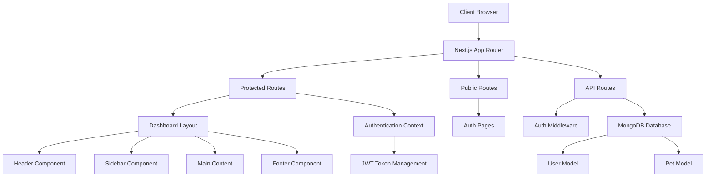

# TailTally - Pet Care Management System
## Product Specification & Development Roadmap

### Project Overview
**TailTally** is a comprehensive web-based Pet Care Management System designed for veterinary clinics, pet care businesses, and pet owners. Built with Next.js 15.5.2, React 19, and MongoDB, it provides a modern, scalable solution for managing pets, appointments, medical records, and business operations.

---

## 🎯 Product Vision & Goals

### Primary Goals
- **Streamline Pet Care Operations**: Provide a centralized platform for managing all aspects of pet care business
- **Enhance Customer Experience**: Enable pet owners to easily access their pet's information and schedule appointments
- **Improve Staff Efficiency**: Offer intuitive tools for veterinarians and staff to manage their workflows
- **Data-Driven Insights**: Provide analytics and reporting for business decision making

### Target Users
1. **Pet Owners (Customers)**: Access pet records, schedule appointments, view medical history
2. **Veterinary Staff**: Manage appointments, update medical records, handle day-to-day operations
3. **Veterinarians**: Access complete medical histories, update treatment plans, manage cases
4. **Business Administrators**: Oversee operations, manage users, view analytics and reports

---

## 🏗️ System Architecture

### Technology Stack
- **Frontend**: React 19.1.0, Next.js 15.5.2, Tailwind CSS 3.4.17
- **Backend**: Next.js API Routes, Node.js
- **Database**: MongoDB with Mongoose ODM
- **Authentication**: JWT with HTTP-only cookies
- **UI Components**: Radix UI primitives, Lucide React icons
- **Development**: ESLint, PostCSS, Hot reload

### Current Architecture Pattern

---

## 📋 Current Implementation Status

### ✅ COMPLETED FEATURES

#### 1. **Foundation & Setup** 
- ✅ Next.js 15.5.2 project initialization
- ✅ Tailwind CSS configuration with custom theme
- ✅ ESLint and development environment setup
- ✅ MongoDB connection and configuration
- ✅ Environment variables structure
- ✅ Package.json with all necessary dependencies

#### 2. **Authentication System** 
- ✅ Complete JWT-based authentication
- ✅ Role-based access control (Admin, Veterinarian, Staff, Customer)
- ✅ Permission-based authorization system
- ✅ Secure password hashing with bcrypt
- ✅ Login attempt tracking and account locking
- ✅ HTTP-only cookie management
- ✅ Frontend authentication context with React hooks
- ✅ Protected route middleware
- ✅ Auth API endpoints: `/api/auth/login`, `/api/auth/signup`, `/api/auth/logout`, `/api/auth/me`

#### 3. **User Management**
- ✅ Comprehensive User model with validation
- ✅ User profile management
- ✅ Role-based permissions system
- ✅ Professional information for staff/veterinarians
- ✅ Account security features (lockout, attempts tracking)
- ✅ User preferences and settings structure

#### 4. **Pet Data Management**
- ✅ Pet model with complete schema
- ✅ Owner association and information
- ✅ Medical history tracking
- ✅ Vaccination records
- ✅ Pet CRUD operations structure

#### 5. **UI/UX Foundation**
- ✅ Modern dashboard layout with responsive design
- ✅ Reusable UI component library (Button, Card, Input, Avatar, etc.)
- ✅ Sidebar navigation with collapsible functionality
- ✅ Header with search, notifications, and user menu
- ✅ Authentication modal and forms (Login/Signup)
- ✅ Loading states and error handling
- ✅ Glassmorphism design with animations
- ✅ Mobile-responsive navigation

#### 6. **API Infrastructure**
- ✅ Health check endpoint (`/api/health`)
- ✅ User management endpoints (`/api/users`)
- ✅ Pet management endpoints (`/api/pets`)
- ✅ Authentication middleware for route protection
- ✅ Error handling and validation

#### 7. **Navigation & Routing**
- ✅ Protected route implementation
- ✅ Automatic redirection based on authentication state
- ✅ Proper handling of browser back/forward navigation
- ✅ Route-based access control

---

## 🚧 PENDING IMPLEMENTATION

### Phase 1: Core Business Logic (Immediate - Next 2-3 weeks)

#### Task 1.1: **Pet Management Interface** (Priority: HIGH)
**Status**: 🔴 Not Started  
**Estimated Time**: 3-4 days  
**Description**: Create complete pet management functionality
**Requirements**:
- Pet listing page with search, filter, and pagination
- Pet profile pages with detailed information
- Add/Edit pet forms with validation
- Medical history display and management
- Vaccination schedule tracking
- Photo upload and management
- Quick action buttons (view, edit, delete)
- Owner association and contact information

**Dependencies**: Authentication system ✅  
**Deliverables**: 
- `/pets` route with full CRUD interface
- Pet detail views
- Form validations
- API integration

#### Task 1.2: **Dashboard Analytics & Statistics** (Priority: HIGH)
**Status**: 🔴 Not Started  
**Estimated Time**: 2-3 days  
**Description**: Implement dashboard with real-time statistics and insights
**Requirements**:
- Total pets, active customers, appointments metrics
- Recent activity feed
- Quick action cards
- Upcoming appointments preview
- Revenue/billing summary
- Staff activity dashboard
- Mobile-responsive charts and graphs

**Dependencies**: Pet management ✅, User management ✅  
**Deliverables**: 
- Interactive dashboard with live data
- Statistics API endpoints
- Chart components

#### Task 1.3: **Appointment Management System** (Priority: HIGH)
**Status**: 🔴 Not Started  
**Estimated Time**: 5-6 days  
**Description**: Complete appointment scheduling and management system
**Requirements**:
- Appointment model and database schema
- Calendar view (daily, weekly, monthly)
- Appointment booking interface
- Staff assignment and scheduling
- Appointment status tracking (scheduled, in-progress, completed, cancelled)
- Email/SMS notifications (basic structure)
- Time slot management
- Recurring appointments
- Conflict detection

**Dependencies**: Pet management, User management ✅  
**Deliverables**: 
- `/appointments` routes and pages
- Calendar components
- Booking system
- Notification system foundation

### Phase 2: Advanced Features (2-4 weeks)

#### Task 2.1: **Medical Records Management** (Priority: MEDIUM)
**Status**: 🔴 Not Started  
**Estimated Time**: 4-5 days  
**Description**: Comprehensive medical records and treatment tracking
**Requirements**:
- Medical record model with detailed schema
- Treatment history tracking
- Prescription management
- Medical notes and observations
- File/document attachments
- Medical templates and forms
- Search and filter capabilities
- Print/export functionality

#### Task 2.2: **Inventory Management** (Priority: MEDIUM)
**Status**: 🔴 Not Started  
**Estimated Time**: 4-5 days  
**Description**: Stock and inventory tracking system
**Requirements**:
- Product/medication inventory
- Stock level tracking and alerts
- Supplier management
- Purchase order system
- Usage tracking
- Expiry date monitoring
- Barcode scanning support (future)

#### Task 2.3: **Customer Relationship Management** (Priority: MEDIUM)
**Status**: 🔴 Not Started  
**Estimated Time**: 3-4 days  
**Description**: Enhanced customer management and communication
**Requirements**:
- Customer profiles with detailed information
- Communication history
- Follow-up scheduling
- Customer preferences and notes
- Contact management
- Customer portal access

### Phase 3: Business Operations (3-5 weeks)

#### Task 3.1: **Billing & Payment System** (Priority: MEDIUM)
**Status**: 🔴 Not Started  
**Estimated Time**: 6-7 days  
**Description**: Complete billing and payment processing
**Requirements**:
- Invoice generation and management
- Payment processing integration
- Billing history and tracking
- Price lists and service catalogs
- Discount and promotion management
- Payment reminders
- Financial reporting

#### Task 3.2: **Reporting & Analytics** (Priority: LOW)
**Status**: 🔴 Not Started  
**Estimated Time**: 4-5 days  
**Description**: Business intelligence and reporting system
**Requirements**:
- Revenue and financial reports
- Customer and pet statistics
- Staff performance metrics
- Appointment analytics
- Inventory reports
- Custom report builder
- Data export capabilities

#### Task 3.3: **Notification & Communication System** (Priority: MEDIUM)
**Status**: 🔴 Not Started  
**Estimated Time**: 3-4 days  
**Description**: Comprehensive notification and messaging system
**Requirements**:
- Email notification system
- SMS integration (optional)
- In-app notifications
- Appointment reminders
- Treatment follow-ups
- Marketing communications
- Notification preferences

### Phase 4: Enhancement & Optimization (4-6 weeks)

#### Task 4.1: **Advanced Search & Filtering** (Priority: LOW)
**Status**: 🔴 Not Started  
**Estimated Time**: 2-3 days  
**Description**: Enhance search capabilities across the platform
**Requirements**:
- Global search functionality
- Advanced filtering options
- Search result ranking
- Search history and suggestions
- Quick filters and saved searches

#### Task 4.2: **Mobile App Development** (Priority: LOW)
**Status**: 🔴 Not Started  
**Estimated Time**: 8-10 days  
**Description**: Native or PWA mobile application
**Requirements**:
- Mobile-optimized interface
- Offline capability
- Push notifications
- Camera integration for photos
- QR code scanning
- Mobile-specific features

#### Task 4.3: **Integration & API Development** (Priority: LOW)
**Status**: 🔴 Not Started  
**Estimated Time**: 5-6 days  
**Description**: External integrations and public API
**Requirements**:
- Third-party service integrations
- Public API for developers
- Webhook system
- Data import/export tools
- Backup and sync capabilities

---

## 🔄 Development Workflow

### Task Execution Strategy
1. **Sequential Development**: Complete each task fully before moving to the next
2. **Testing First**: Implement proper testing for each feature
3. **Documentation**: Update documentation with each feature implementation
4. **Code Review**: Ensure code quality and consistency
5. **User Testing**: Validate features with target users

### Quality Standards
- **Code Coverage**: Minimum 80% test coverage
- **Performance**: Page load times under 2 seconds
- **Accessibility**: WCAG 2.1 AA compliance
- **Security**: Regular security audits and best practices
- **Mobile First**: Responsive design for all features

### Git Workflow
- Feature branch for each task
- Pull request review process
- Automated testing on CI/CD
- Regular integration with main branch

---

## 📊 Success Metrics

### Technical Metrics
- **Performance**: 90+ Lighthouse score
- **Uptime**: 99.9% availability
- **Response Time**: API responses under 200ms
- **Security**: Zero critical vulnerabilities

### Business Metrics
- **User Adoption**: Monthly active users
- **Feature Usage**: Engagement with core features
- **Customer Satisfaction**: User feedback and ratings
- **Business Growth**: Revenue and operational efficiency

---

## 🎯 Next Steps

### Immediate Actions (This Week)
1. **Start Task 1.1**: Begin Pet Management Interface implementation
2. **Setup Testing Framework**: Implement Jest and testing utilities
3. **Create Component Library**: Standardize UI components
4. **Database Seeding**: Create sample data for development

### Short Term (Next 2 Weeks)
1. Complete Pet Management Interface
2. Implement Dashboard Analytics
3. Begin Appointment Management System
4. Setup proper error handling and logging

### Medium Term (Next Month)
1. Complete Phase 1 tasks
2. Begin Phase 2 implementation
3. Conduct user testing sessions
4. Performance optimization

---

## 📝 Notes & Considerations

### Technical Debt
- Need to implement proper error boundaries
- Add comprehensive logging system
- Improve type safety with TypeScript (future consideration)
- Implement caching strategy for better performance

### Security Considerations
- Regular security audits
- HTTPS enforcement in production
- Data encryption at rest
- Regular dependency updates
- OWASP compliance

### Scalability Planning
- Database optimization and indexing
- CDN implementation for static assets
- Load balancing for high availability
- Microservices architecture (future consideration)

---

**Document Version**: 1.0  
**Last Updated**: January 30, 2025  
**Next Review**: February 6, 2025  

---

*This document will be updated as development progresses and requirements evolve.*